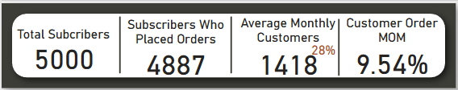

Project Summary
---
> _"As Choplife expands its footprint across Nigeria, is our growth truly sustainable—or are we scaling inefficiencies?"_

Choplife by Sam, a fast-growing food delivery brand, is on a mission to **deliver great meals fast and consistently**. But beneath the surface of rising subscriber numbers lies a hidden challenge: misaligned operations, underperforming marketing, and declining customer retention.

This project seeks to **uncover operational blind spots and inform investor-readiness** by analyzing customer, delivery, and marketing data.

---

##  Executive Summary

| Metric                            | Value                   | Insight                                                                 |
|----------------------------------|--------------------------|-------------------------------------------------------------------------|
| Total Subscribers                | 5,000                    | But only 4,887 placed an order — why the 2.3% drop-off?                 |
| Monthly Active Users (MAU)       | 1,418 avg                | User engagement is declining — churn > acquisition                     |
| Repeat Customers                 | 4,530 (93%)              | High loyalty, but no new sign-ups in 2024 — is growth stalling?        |
| Average Delivery Time            | **54 mins**              | Exceeds the company’s 45 min target                                 |
| On-time Delivery Rate            | **37%**                  | 6 out of 10 meals arrive late — eroding brand trust                    |
| Total Revenue (2 Years)          | ₦286M                    | Marketing spend (₦781M) is 2.7x this — ROI concerns                    |
| Customer Acquisition Cost (CAC) | ₦156,250                 | While Revenue per Customer = ₦57,200 → Huge gap                        |

---

## Key Business Questions Answered

>  **Are we growing fast enough—and in the right locations?**
#### 1. Customer Base & Activity
The business has onboarded a total of 5,000 subscribers, with a promising 4,887 of them placing orders, translating to a 97.7% conversion. Even more impressive, 4,530 of these customers are repeat buyers, indicating a loyalty rate of over 93%.

However, there’s a worrying trend. While monthly active users average 1,418, the sign-up funnel has dried up since the end of 2023. The customer base is no longer growing. Instead, churn is quietly eating into the numbers while new signups are at a standstill. The lack of fresh acquisitions puts future revenue and scalability at risk.

  

>  **Are our operations efficient and scalable?**  
#### 2.Operational Efficiency
One of the most critical areas of concern is logistics. Despite an internal target of 45-minute deliveries, the average delivery time stands at 54 minutes. Even worse, only 37% of deliveries are completed on time, meaning nearly two-thirds arrive late.

Whether it’s Kano, Lagos, Abuja, or any of the other cities, the data shows consistently underperforming delivery operations. The delivery partners—Choplife Fleet, GIG, and Kwik—are all delivering at the same slow pace. Whether it’s breakfast, lunch, or dinner, delays are the norm, not the exception.

#### 3.Payment Preferences
When it comes to how customers pay, the platform seems to be doing well. Payments are evenly split among bank transfers (6.9K orders), cards (6.6K), and wallets (6.5K). This balanced spread shows good adoption of multiple payment channels and indicates flexibility for users.

#### 4. Geographic Performance
The dashboard also highlights regional trends. Abuja, Ibadan, and Enugu are the top three performing cities in terms of revenue, each bringing in over ₦29 million. However, the difference between the top and bottom cities is marginal, indicating a fairly even distribution of demand across locations.

But revenue isn’t the only performance marker. Delivery efficiency across all cities is poor, with on-time delivery rates barely scraping 35% to 39%, regardless of the city. This shows systemic operational issues—not isolated city-level problems.

> **Are we ready for investors?**

 #### 5. Customer Behavior
Choplife has done a great job keeping existing customers happy. A whopping 93% are repeat users, with only 7% having placed just one order. But the flip side is clear: without new signups coming in, this loyalty won’t be enough to fuel future growth.

The high retention is encouraging, but the flatline in user acquisition post-2023 highlights a significant gap in the company’s customer lifecycle strategy.
 #### 6. Revenue and Financial Health
At first glance, ₦286 million in total revenue sounds promising. But a deeper look into the financials reveals a red flag: marketing spend sits at a massive ₦781 million, almost three times the revenue earned.

For every new customer gained, Choplife spends ₦156,250, but each customer brings in only ₦57,200. That’s a customer acquisition cost (CAC) that overshadows the return by 2.7x—a deeply unsustainable model.

This imbalance shows that Choplife is spending heavily to acquire customers but not getting enough back in lifetime value.

 #### 7. Marketing Performance
The marketing strategy is where the business seems most vulnerable. With over ₦781 million spent, platforms like Twitter and Instagram saw the largest budgets—but conversion rates remained dismally low.

From a reach of 151.5 million, only 3.04 million people converted (2.01%). Even worse, just 0.005 million subscribers came out of that (0.16%).

In essence, the company is reaching millions, but almost none of that is translating into paying users. Marketing ROI is dangerously low, and continued spending at this rate will only widen the loss margins.

 #### Strategic Recoommendation
 ##### 1. Improve Delivery Efficiency
- Enforce service-level agreements (SLAs) with delivery partners.
- Deploy customer-facing tracking and internal dashboards for real-time performance.
- Pilot a "30-minute delivery zone" in cities like Abuja and Ibadan.
  > Expected outcome: Faster delivery, increased satisfaction, and reduced churn.

##### 2. Reignite Customer Acquisition
- Pause underperforming marketing channels (Twitter, Email); shift to high-ROI channels like Google Search and TikTok.
- Launch referral incentives and personalized offers to attract new and returning users.
- Retarget churned users with SMS/email campaigns.
  > Expected outcome: Reduced CAC, higher conversion rate, and resumed growth.

##### 3. Increase Customer Lifetime Value
-	Launch a loyalty rewards program to encourage repeat orders.
- Use data to personalize offers by meal type or location.
- Offer exclusive benefits (e.g., express delivery) to top-tier users.
  > Expected outcome: Increased order frequency and retention.

##### 4. Double Down on High-Performing Cities
- Focus resources in high-revenue locations: Abuja (₦31.4M), Ibadan (₦30.1M), Enugu (₦29.4M).
- Collaborate with local influencers and businesses.
- Temporarily deprioritize low-ROI cities (e.g., Jos, Ilorin).
  > Expected outcome: Maximized regional ROI and targeted growth.

##### 5. Prepare for Investor Engagement
- Create a clear investor dashboard showing retention strength, improving delivery KPIs, and CAC optimization progress.
- Define a scalable growth plan tied to capital utilization (e.g., new delivery hubs, technology investment).
- Publish monthly performance reports for transparency and credibility.
  > Expected outcome: Greater investor confidence and readiness for Series A fundraising.

 ---

 
##  Dashboard Preview

 [View the full dashboard in PDF](.Cyber_Security_Dashboard.pdf)  
 Explore the interactive and dynamic dashboard in [Power BI here](https://app.powerbi.com/view?r=eyJrIjoiNDlhMTJhZmUtYTYyYy00MmYwLWFjZjQtYTUyMzVmZWMxNzNjIiwidCI6IjJjZDk3YzU4LTY0ODAtNDEzYS1hNjMyLWI1OTNiMDZkZjgyOCJ9).
 

---
## 👋 Meet the Analyst

Hi! I’m **Ufuoma Ogeh**, and I love uncovering insights that help people make better decisions. With a background in supply chain inventory management and a passion for data storytelling, I use tools like excel, Power BI and SQL to bring numbers to life.  

📬 Let’s connect:  
[LinkedIn](https://www.linkedin.com/in/uogeh/) | [Email](ufuomaogeh@yahoo.com) | [Portfolio](https://uogeh.github.io/Ufuomaportfolio/) | [Medium post](https://medium.com/@ogehufuoma)

